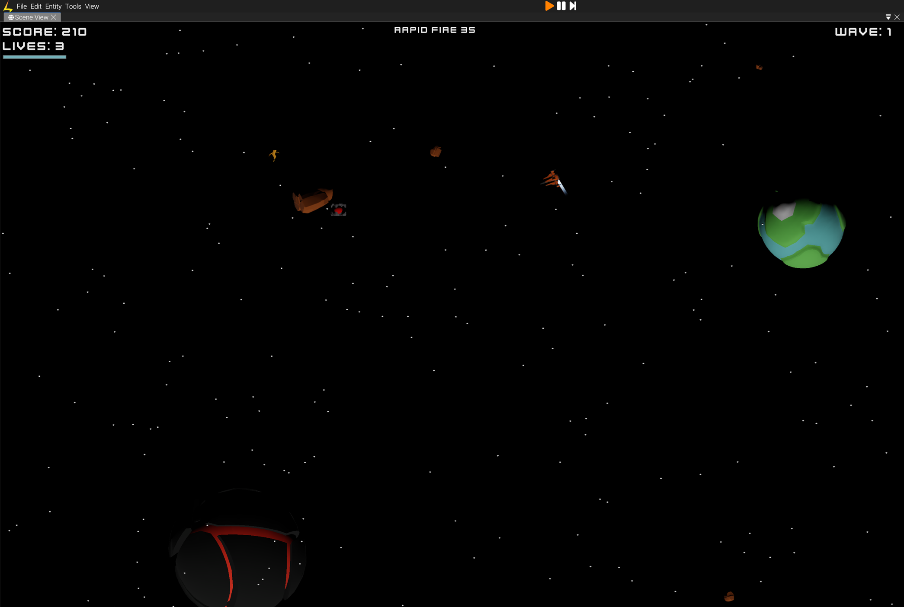

# Lumix Showcase

A small collection of sample projects built with the Lumix game engine.

## Projects

| Project | Screenshot | Docs |
| --- | --- | --- |
| Asteroids |  | [asteroids/README.md](asteroids/README.md) |
| Tower Defense |  | [tower_defense/README.md](tower_defense/README.md) |
| Chess |  | [chess/README.md](chess/README.md) |
| Platformer |  | [platformer/README.md](platformer/README.md) |
| Hex |  | [hex/README.md](hex/README.md) |

## License

Code in this repository is licensed under MIT (see [LICENSE](LICENSE)). Individual projects may contain third-party assets under their own licenses—see each project README for details.
