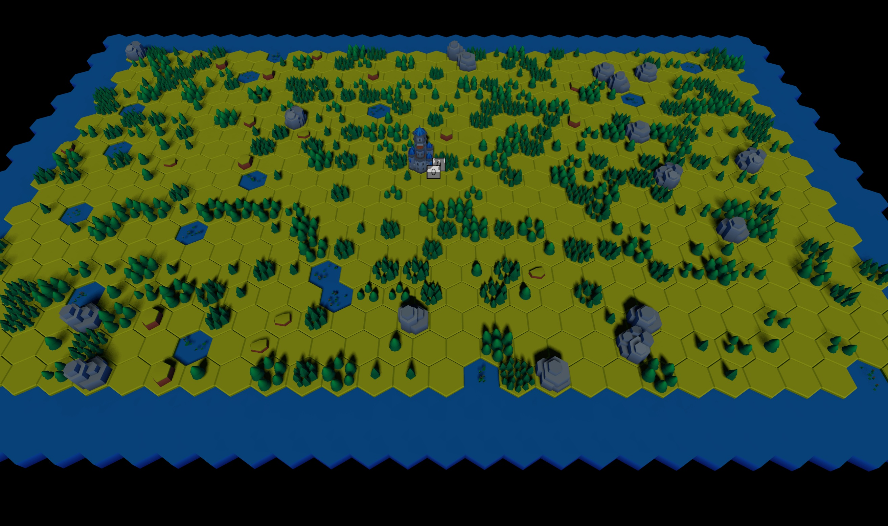

# Hex Lumix

A turn-based, roguelike, hex-grid survival and building game built using the Lumix game engine.

## Description

Manage a settlement on a hex grid, balancing resources, infrastructure, exploration, and avoidance of environmental hazards. No combat, just strategic placement, resource management, and survival against the elements. Features procedural generation for high replayability.

## Screenshots

## Features

- Hex-grid territorial expansion with adjacency rules
- Building and zoning system (farms, water catchments, workshops, bridges)
- Resource management (food, water, materials, fuel, power)
- Turn-based actions with action budget
- Environmental hazards (storms, floods, landslides, blight, toxic mists)
- Procedural map generation with random resources and events
- Tech tree progression and roguelike unlocks

## Assets

- 3D models from various sources (fantasy/historical palette). See [hex/models/](models/) for details.

## Project Structure

- `hex.lua`: Main game script
- `hex.unv`: Scene
- `gameplay.md`: Detailed gameplay mechanics
- `models/`: Environment and structure models

